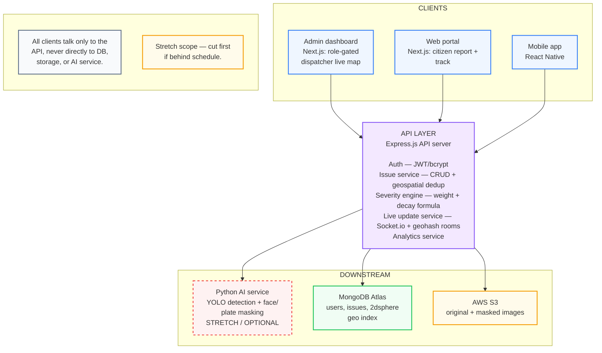

# UrbanOps

Real-time city infrastructure command center. Extends **UrbanLens** (prior semester's citizen-facing mobile reporting app) with a full MERN backend, geospatial deduplication, live dispatch dashboard, and role-gated web clients.

## Problem

UrbanLens lets citizens report issues (potholes, leaks, hazards) via photo + GPS. At scale, the same issue gets reported dozens of times, flooding the city's system with duplicate tickets and no way to prioritize.

## Solution

UrbanOps sits between citizen reports and city dispatchers:

1. **Dedup** — new reports are checked against existing open issues within 100m using the same category. Duplicates increment a counter instead of creating new tickets.
2. **Severity scoring** — each issue gets a score based on category weight, duplicate count, and time decay, so stale or low-impact issues naturally rank lower.
3. **Live dashboard** — dispatchers see new/updated issues instantly via WebSocket, segmented by geohash room (no GeoJSON ward-boundary dependency).
4. **Kanban workflow** — issues move Open → Dispatched → Resolved. No routing/VRP solver in v1 (explicitly scoped out — see PRD).

## Architecture

## Tech Stack

- **Frontend:** React Native (mobile), Next.js (web portal + admin dashboard)
- **Backend:** Node.js, Express.js
- **Database:** MongoDB Atlas (2dsphere geospatial index)
- **Real-time:** Socket.io (geohash-keyed rooms)
- **Storage:** AWS S3
- **Stretch:** Python (YOLO photo masking)

## Core Modules

| Module | Responsibility |
|---|---|
| Auth service | JWT + bcrypt, role-based access (citizen / dispatcher / admin) |
| Issue service | CRUD, `$geoNear` + category dedup |
| Severity engine | `baseWeight + (duplicateCount × multiplier) − (hoursSinceLastReport × decayRate)` |
| Live update service | Socket.io, geohash-prefix rooms |
| Analytics service | Category breakdowns |
| AI masking (stretch) | Separate Python service, YOLO detection + masking |

## Explicit Scope Cuts

- **No multi-stop routing / VRP solver.** NP-hard, out of scope for a 12–15 week semester project. Kanban board replaces it. Production version would integrate OSRM/Google Directions API.
- **No ward-boundary WebSocket rooms.** Geohash prefix used instead to avoid a GeoJSON boundary-data dependency.
- **AI photo masking is stretch scope**, cut first if behind schedule.

## Team

1RUA24SCS0068 Nishit Patel · 1RUA24SCS0072 Pragun Lal Shrestha · 1RUA24SCS0077 Pranav Adhikari · 1RUA24SCS0118 Unique Bhakta Shrestha . 1RUA24SCS0099 Sameera Simha Jayasimha
